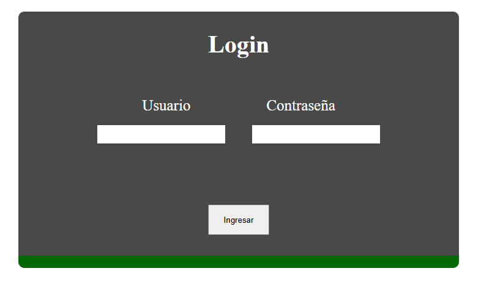

<h1>íNDICE</h1>
<ul>
  <a href= "#resumen"><li>Resumen</li></a>
  <a href= "#proyecto"><li>Proyecto de login</li></a>
  <a href= "#instrucciones"><li>Instrucciones para clonar y ejecutar el login</li></a>
  <ul>
    <a href= "#requisitos_previos"><li>Requisitos previos</li></a>
    <a href= "#clonar_repositorio"><li>Cómo clonar el repositorio</li></a>
    <a href= "#configurar_servidor"><li>Cómo configurar el servidor web</li></a>
    <a href= "#configurar_bd"><li>Cómo configurar la base de datos</li></a>
    <a href= "#acceder"><li>Cómo acceder al proyecto</li></a>
  </ul>
  <a href= "#estructura"><li>Estructura del proyecto</li></a>
</ul>

 
 
 
 
<h1 id="proyecto" align="center"> PROYECTO DE LOGIN </h1>
 

  

 
 
 
 

<h2 id="resumen" align="center"> RESUMEN </h2>
Este proyecto tuvo como objetivo la creación de un login funcional conectado a una base de datos alojada en phpMyAdmin. Para crear la base se utilizó MySQL Workbench y para alojarla en php se utilizó XAMPP. 

 
 
 
 
<h2 id="instrucciones" align="center">Instrucciones para clonar y ejecutar el login</h2>
<h3 id="requisitos_previos">Requisitos previos</h3>
<ol>
  <li>Asegúrate de tener instalado PHP</li>
  <li>Asegúrate de tener instalado un servidor como XAMPP o MAMP. <em>(En mi caso utilicé XAMPP)</em> </li>
  <li>Asegúrate de tener instalado un gestor de base de datos de MySQL. <em>(En mi caso utilicé MySQL Workbench)</em></li>
  <li>Asegúrate de tener un cliente de control de versiones como Git</li>
</ol>

<h3 id="clonar_repositorio">Cómo clonar el repositorio</h3>
<ol>
  <li>Abre una terminal y navega al directorio donde deseas clonar el repositorio.</li>
  <li>Ejecuta el siguiente comando: git clone https://github.com/tuusuario/nombre-del-repositorio.git</li>
  <li>Cambia el directorio del proyecto: cd nombre-del-repositorio</li>
</ol>

<h3 id= "configurar_servidor">Cómo configurar el servidor web</h3>
<ol>
  <li>Copia los archivos del proyecto al directorio público del servidor web:</li>
    <ul>
      <li><strong>En XAMPP:</strong> mueve los archivos al directorio htdocs.</li>
            <li><strong>En MAMPP:</strong> mueve los archivos al directorio correspondiente (por ejemplo, www).</li>
    </ul>
  <li>Asegúrate de que el servidor Apache esté corriendo.</li>
</ol>

<h3 id="configurar_bd">Cómo configurar la base de datos</h3>
<ol>
  <li>Abre el cliente de administración de bases de datos <strong>(como phpMyAdmin)</strong>.</li>
  <li>Importa el archivo SQL incluido en el proyecto:</li>
    <ul>
      <li>Busca el archivo database.sql en la carpeta /db del proyecto.</li>
      <li>En phpMyAdmin, selecciona "Importar" y carga este archivo.</li>
    </ul>
  <li>Configura las credenciales de acceso a la base de datos:</li>
    <ul>
      <li>Edita el archivo de configuración del proyecto (por ejemplo, config.php) y ajusta:</li>
       
      define('DB_HOST', 'localhost');  
      define('DB_NAME', 'nombre_de_la_base_de_datos');  
      define('DB_USER', 'tu_usuario');  
      define('DB_PASS', 'tu_contraseña'); 
    </ul>
</ol>

<h3 id= "acceder">Cómo acceder al proyecto</h3>
<ol>
  <li>Abre un navegador web.</li>
  <li>Accede a la URL del proyecto, por ejemplo: http://localhost/nombre-del-repositorio</li>
</ol>

 
 
 
 
<h2 id="estructura" align="center">Estructura del proyecto</h2>
<ul>
  <li><strong>db.php</strong>: Contiene la conexión a la base de datos. Lo hace a través de la variable conexión y mysqli_connect.</li>
   
  <li><strong>logueo.php</strong>: Contiene la conexión del login con el archivo db.php. Consulta si el usuario y la contraseña ingresados existe en la base de datos, es decir, verifica si se trata de una cuenta previamente registrada. Si la cuenta existe, ingresa a la página de inicio de prueba; si no existe, lanza el mensaje de error correspondiente.</li>
   
  <li><strong>login.php</strong>: Contiene el html del login. Éste se compone de un formulario con los campos Usuario y Contraseña.</li>
   
  <li><strong>inicio.php</strong>: Contiene el html de la página de inicio de prueba. Ésta consiste en un cartel con el mensaje "BIENVENIDO A LA PPÁGINA"</li>
   
  <li><strong>login.css</strong>: Contiene los estilos css  aplicados en la página de login.</li>
   
  <li><strong>inicio.css</strong>: Contiene los estilos css  aplicados en la página de inicio.</li>
</ul>

