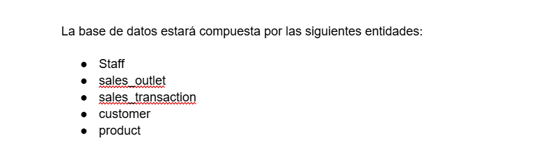
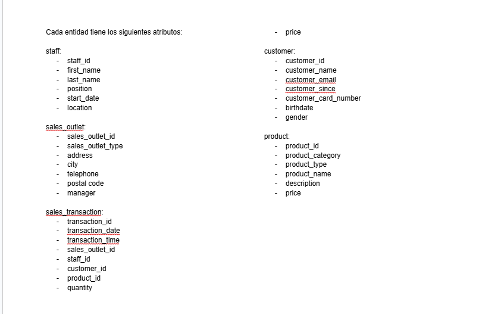
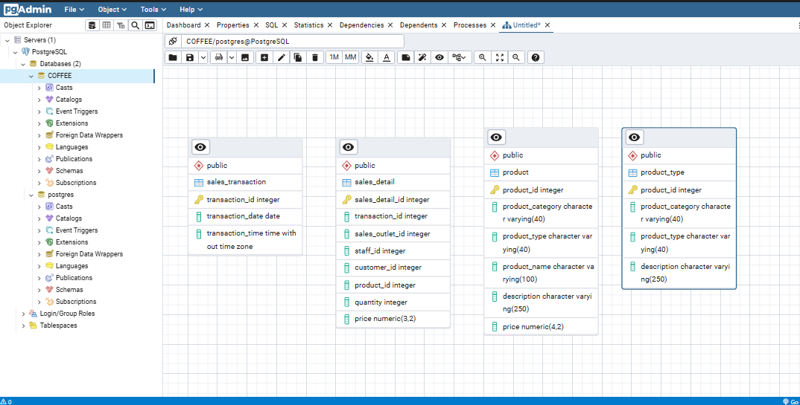
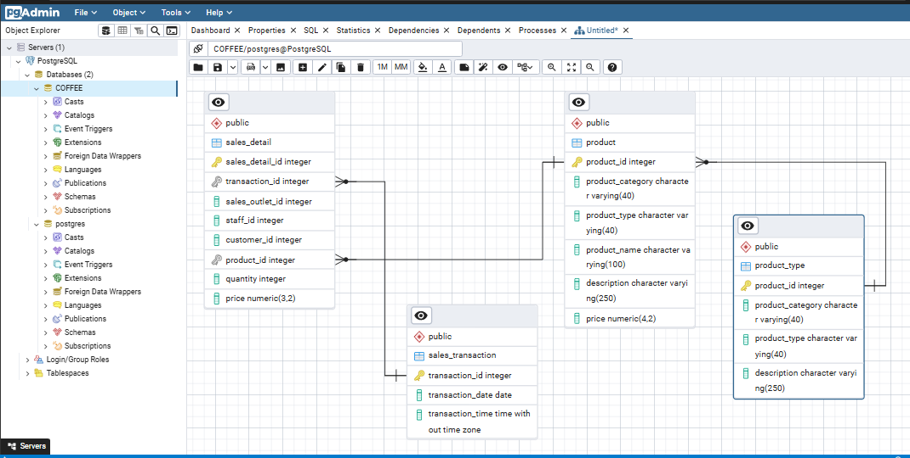
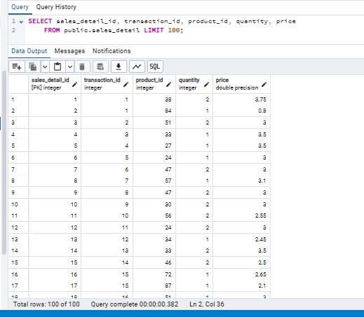
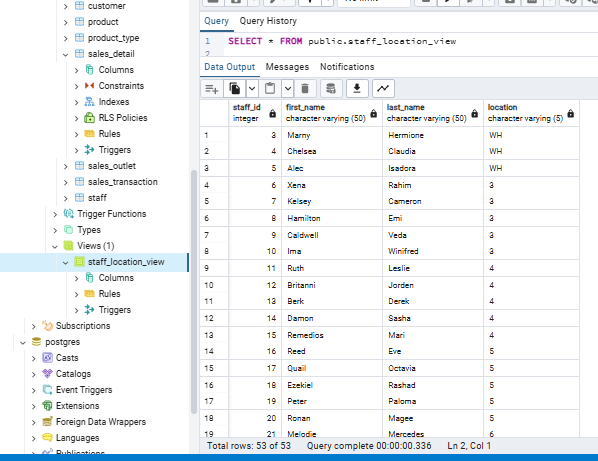
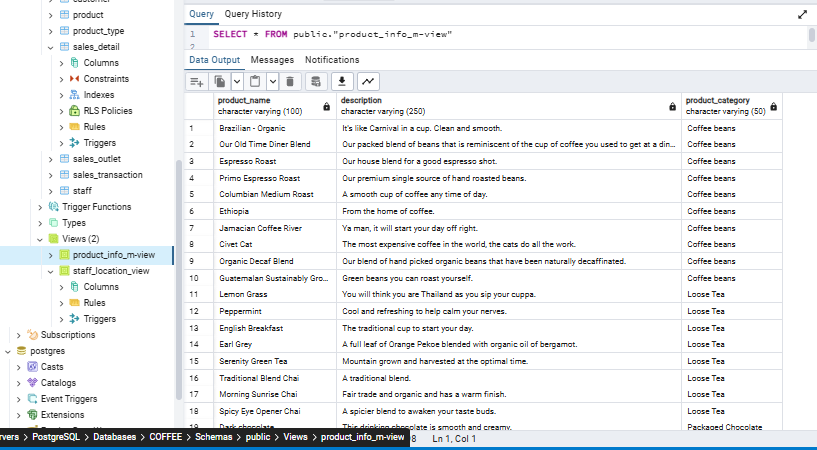
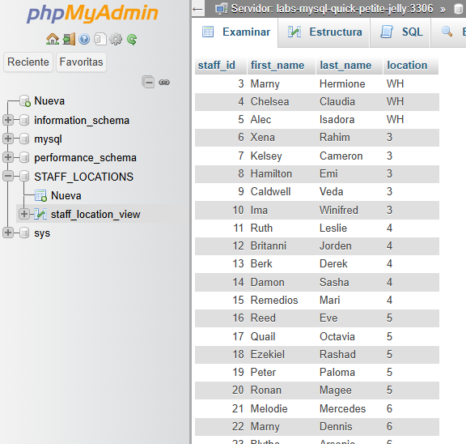
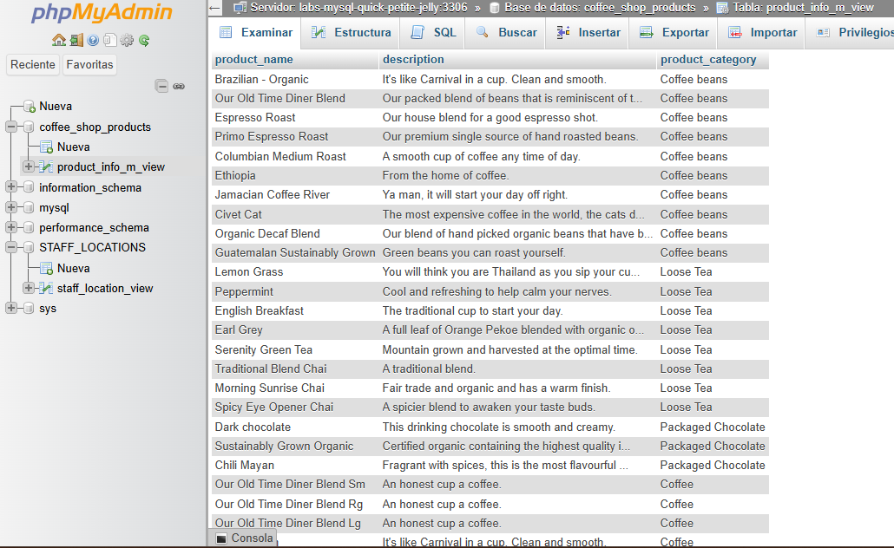

<h1 align = right>Diseño e Implementación de una base de datos</h1>  

 

  <h2>Escenario</h2>
  

    En este escenario, has sido contratado recientemente como Ingeniero de Datos por una cadena de cafeterías con sede en Nueva York que busca expandirse a nivel nacional abriendo varias ubicaciones de franquicias. Quieren optimizar las operaciones y renovar su infraestructura de datos como parte de su proceso de expansión.
 
Tu trabajo es diseñar sus sistemas de bases de datos relacionales para mejorar la eficiencia operativa y facilitar que sus ejecutivos tomen decisiones basadas en datos.
 
Actualmente, sus datos residen en varios sistemas: software de contabilidad, bases de datos de proveedores, sistemas de punto de venta (POS) e incluso hojas de cálculo. Revisarás los datos en todos estos sistemas y diseñarás una base de datos central para albergar todos los datos. Luego, crearás los objetos de la base de datos y los cargarás con datos de origen. Finalmente, crearás subconjuntos de datos que requieren tus socios comerciales, los exportarás y los cargarás en bases de datos de preparación utilizando varios RDBMS.
  

 

  <h2>Herramientas utilizadas:</h2>
   

 

  <h2>Objetivos:</h2>
  <ul>
    <li>Identificar entidades</li>
    <li>Identificar atributos</li>
    <li>Crear un diagrama de relación de entidades (ERD) utilizando la herramienta ERD de pgAdmin</li>
    <li>Normalizar tablas</li>
    <li>Definir claves y relaciones</li>
    <li>Crear objetos de base de datos generando y ejecutando el script SQL desde la herramienta ERD</li>
    <li>Crear una vista y exportar los datos</li>
    <li>Crear una vista materializada y exportar los datos</li>
    <li>Importar datos en una base de datos MySQL utilizando la herramienta GUI phpMyAdmin</li>
  </ul>

 

  

    El primer paso al diseñar una nueva base de datos es revisar cualquier dato existente e identificar las entidades para su nuevo sistema.
  

  
  

    El siguiente paso es identificar los atributos de cada entidad.
  

  
  

    Ahora que he definido algunos de los atributos y entidades, puedo determinar las tablas y columnas para ellos y crear un diagrama de entidad-relación (ERD).
  

  
  

      Para llegar a este modelo normalicé las tablas sales_transaction y product para llevarlas a la segunda forma normal.
  
 
   
  

    Después de normalizar las tablas, puedo definir sus claves primarias y las relaciones entre las tablas en mi diagrama de entidad-relación (ERD).
  

  
  

    Ahora que el diseño está completo, generé un script SQL a partir del ERD, que podré usar para crear el esquema de base de datos. Para este proyecto, utilicé un script SQL dado para asegurarme de que puedo cargar los datos de muestra en el esquema. Finalmente, cargué los datos existentes de varias fuentes en mi nuevo esquema de base de datos.
  

   
   
   
  

       Escenario: La empresa de nómina externa ha solicitado una lista de empleados y las ubicaciones donde trabajan. Esta lista no debe incluir al CEO ni al CFO que son propietarios de la empresa.  
     
    Creé una vista llamada staff_locations_view utilizando el siguiente code:
  

  <pre><code>
SELECT staff.staff_id,
    staff.first_name, 
    staff.last_name,
    staff.location
FROM staff
WHERE "position" NOT IN ('CEO', 'CFO');
  </code></pre>
   
  
   
   
  

      Escenario: Un consultor de marketing requiere acceso a los datos de su producto en su base de datos MySQL para una campaña de marketing.  
     
    Creé una vista llamada product_info_m-view utilizando el siguiente code: 
  

  <pre><code>
    SELECT product.product_name, product.description, product_type.product_category
FROM product
JOIN product_type
ON product.product_type_id = product_type.product_type_id;
  </code></pre>
   
  
   
   
  

      Escenario: La empresa externa de nómina te ha pedido que subas la información de ubicación del personal a su base de datos MySQL.
     
     
    En phpMyAdmin, creé una nueva base de datos llamada STAFF_LOCATIONS, luego importé la información de ubicación guardada en el archivo staff_locations_view.csv.
     
     
    
     
     
    

         Escenario: El consultor de marketing te ha pedido que subas la información del producto a su base de datos MySQL.
       
       
      En phpMyAdmin, creé una nueva base de datos llamada coffee_shop_products, y luego importé la información del producto guardada en el archivo product_info_m-view.csv.
       
       
      
    

   
   
  

      Escenario: La empresa de nómina externa te ha solicitado que subas la información de ubicación del personal a su base de datos Db2.
     
     
    
  

  

 

  

