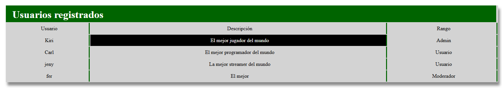

<h1>ÍNDICE</h1>
<ul>
  <a href= "#proyecto"><li>Proyecto de Muestra</li></a>
  <a href= "#resumen"><li>Resumen</li></a>
  <a href= "#instrucciones"><li>Instrucciones para clonar y ejecutar el proyecto</li></a>
    <ul>
      <a href= "#requisitos_previos"><li>Requisitos previos</li></a>
      <a href= "#clonar_repositorio"><li>Cómo clonar el repositorio</li></a>
      <a href= "#configurar_servidor"><li>Cómo configurar el servidor web</li></a>
      <a href= "#configurar_bd"><li>Cómo configurar la base de datos</li></a>
      <a href= "#acceder"><li>Cómo acceder al proyecto</li></a>
    </ul>
  <a href= "#estructura"><li>Estructura del Proyecto</li></a>
</ul>

<h1 id="proyecto" align= center>PROYECTO MUESTRA</h1>
 

 
 
 
 

<h2 id="resumen" align= center>RESUMEN</h2>

Este proyecto tuvo como objetivo presentar una tabla que muestre un listado de los usuarios junto con una descripción y el rol de cada uno.
 
Se creó una base de datos llamada muestra, que contiene dos tablas "Registro" y "Usuario". En la tabla <strong>Registro</strong> son ingresados los usuarios. 
Cada usuario tiene un idregistro, Nombre, Usuario, Contraseña, Descripción y Edad.
 
Cuando un nuevo usuario es registrado, éste se muestra automáticamente en la tabla <strong>"Usuarios"</strong> gracias a un trigger.

 
 
 
 

<h2 id="instrucciones" align="center">Instrucciones para clonar y ejecutar el login</h2>
<h3 id="requisitos_previos">Requisitos previos</h3>
<ol>
  <li>Asegúrate de tener instalado PHP</li>
  <li>Asegúrate de tener instalado un servidor como XAMPP o MAMP. <em>(En mi caso utilicé XAMPP)</em> </li>
  <li>Asegúrate de tener instalado un gestor de base de datos de MySQL. <em>(En mi caso utilicé MySQL Workbench)</em></li>
  <li>Asegúrate de tener un cliente de control de versiones como Git</li>
</ol>

<h3 id="clonar_repositorio">Cómo clonar el repositorio</h3>
<ol>
  <li>Abre una terminal y navega al directorio donde deseas clonar el repositorio.</li>
  <li>Ejecuta el siguiente comando: 
    <pre><code>git clone https://github.com/tuusuario/nombre-del-repositorio.git</code></pre></li>
  <li>Cambia el directorio del proyecto: cd nombre-del-repositorio</li>
</ol>

<h3 id= "configurar_servidor">Cómo configurar el servidor web</h3>
<ol>
  <li>Copia los archivos del proyecto al directorio público del servidor web:</li>
    <ul>
      <li><strong>En XAMPP:</strong> mueve los archivos al directorio htdocs.</li>
            <li><strong>En MAMPP:</strong> mueve los archivos al directorio correspondiente (por ejemplo, www).</li>
    </ul>
  <li>Asegúrate de que el servidor Apache esté corriendo.</li>
</ol>

<h3 id="configurar_bd">Cómo configurar la base de datos</h3>
<ol>
  <li>Abre el cliente de administración de bases de datos <strong>(como phpMyAdmin)</strong>.</li>
  <li>Importa el archivo SQL incluido en el proyecto:</li>
    <ul>
      <li>Busca el archivo database.sql en la carpeta /db del proyecto.</li>
      <li>En phpMyAdmin, selecciona "Importar" y carga este archivo.</li>
    </ul>
  <li>Configura las credenciales de acceso a la base de datos:</li>
    <ul>
      <li>Edita el archivo de configuración del proyecto (por ejemplo, config.php) y ajusta:</li>
       
      <pre><code>
      define('DB_HOST', 'localhost');  
      define('DB_NAME', 'nombre_de_la_base_de_datos');  
      define('DB_USER', 'tu_usuario');  
      define('DB_PASS', 'tu_contraseña');
      </code></pre>
    </ul>
</ol>

<h3 id= "acceder">Cómo acceder al proyecto</h3>
<ol>
  <li>Abre un navegador web.</li>
  <li>Accede a la URL del proyecto, por ejemplo: 
    <pre><code>http://localhost/nombre-del-repositorio</code></pre></li>
</ol>

 
 
 
 
<h2 id="estructura" align="center">Estructura del proyecto</h2>
<ul>
  <li><strong>db.php</strong>: Contiene la conexión a la base de datos. Lo hace a través de la variable conexión y mysqli_connect.</li>
   
  <li><strong>muestra.php</strong>: Contiene la conexión de la tabla con el archivo db.php. Si la tabla contiene registros, los muestra en pantalla. Este archivo contiene la conexión y el html de la tabla.</li>
   
  <li><strong>muestra.css</strong>: Contiene los estilos de la tabla.</li>
   
</ul>
